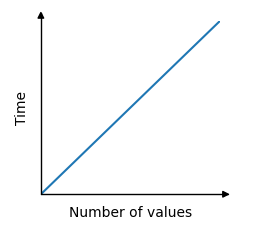

# DSA

## Complexity

It basically means the time taken for a particular task to be completed. So, for that we can time the code to tell us how long it took (**runtime**). 
 
But, this will vary depending on the programming language and the computer you're working with. 
 
That's why use something more abstract (than runtime) called **time complexity**.

 
Relation between time and number of values is linear: 
Higher the number of values, higher will be the number of operations (one operation == one iteration) and higher will be the time required.

 

    

## Big O Notation

Big O notation is used specifically to find the worst case time complexity for an algorithm. 
 
It is written as $O(n)$ , where '$n$' is the number of values.

<table>
    <tr><th>time Complexity</th><th>Algorithm</th></tr>
    <tr><td>$O(n)$</td><td>No matter the size of the array, an element can be looked up directly, it just requires one operation.</td></tr>
</table>