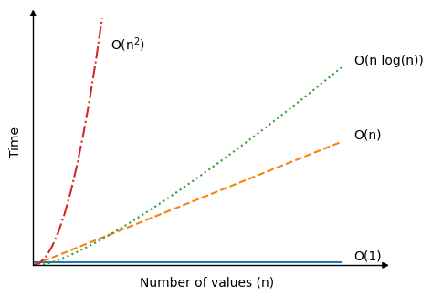

# DSA

## Complexity

It basically means the time taken for a particular task to be completed. So, for that we can time the code to tell us how long it took (**runtime**). 
 
But, this will vary depending on the programming language and the computer you're working with. 
 
That's why use something more abstract (than runtime) called **time complexity**.

 
Relation between time and number of values is linear: 
Higher the number of values, higher will be the number of operations (one operation == one iteration) and higher will be the time required.

 

    

 
Time complexity becomes more and more relevant when number of values increases.

## Big O Notation

Big O notation is used specifically to find the worst case time complexity for an algorithm. 
 
It is written as $O(n)$ , where '$n$' is the number of values.

<table>
    <tr><th>Time Complexity</th><th>Algorithm</th></tr>
    <tr><td>$O(1)$</td><td>No matter the size of the array, an element can be looked up directly, it just requires one operation (indexing).  Eg: print(arr[5])</td></tr>
    <tr><td>$O(n)$</td><td>The algorithm must do $n$ operations in an array with $n$ values to find the lowest value, because the algorithm must compare each value one time.  Eg: Finding the lowest number in an array</td></tr>
    <tr><td>$O(n^2)$</td><td>Large data sets slows down these algorithms significantly. With just an increase in n from 10 to 20 values, the number of operations can increase polynomially.  Eg: Bubble sort, Selection sort and Insertion sort </td></tr>
    <tr><td>$O(nlog(n))$</td><td>Lies in middle of the previous two.  Eg: Quick sort</td></tr>
</table> 

Here is the visual representation of the time complexities:

 

    

